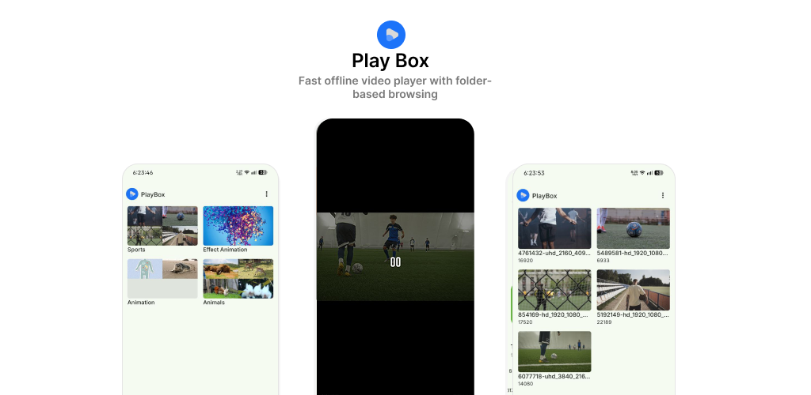

# PlayBox — Video Player for Android

A clean, modern local video player for Android built with Jetpack Compose and Media3/ExoPlayer.

Browse your videos organized by folder, play them in fullscreen, and control every aspect of playback — all with a minimal, distraction-free UI.

---

## Features

- **Folder-based browsing** — videos are grouped by their on-device folder, each shown with a thumbnail collage
- **Fullscreen playback** — immersive mode with system bars hidden; swipe to reveal them transiently
- **Play/Pause & Seek** — smooth seek bar with live position tracking (250 ms updates)
- **Content scaling** — cycle through 6 modes: Fit, Crop, Fill Bounds, Fill Width, Fill Height, Inside
- **Orientation control** — auto-rotates with device sensor; lock button to freeze the current orientation
- **Open with** — registered as a video handler; open any `video/*` file directly from a file manager or browser
- **Video thumbnails** — generated from the first second of each video, cached by Coil

---

## Screenshots

<!-- Add your Play Store screenshots to the /ss folder at the repo root. -->

<p align="center">
  
</p>

---

## Tech Stack

| Layer | Library |
|---|---|
| UI | Jetpack Compose + Material3 Expressive |
| Playback | Media3 / ExoPlayer 1.9.0 |
| Navigation | Navigation3 (type-safe, alpha) |
| Image loading | Coil 2.7.0 + custom `VideoFrameDecoder` |
| State | ViewModel + StateFlow + `collectAsStateWithLifecycle` |
| Permissions | Accompanist Permissions |
| Serialization | kotlinx.serialization (nav destinations) |

---

## Requirements

- Android 8.0+ (minSdk 26)
- Targets Android 16 (SDK 36)

---

## Download

[](https://play.google.com/store/apps/details?id=com.roaa.playbox)

---

## Building from Source

```bash
# Clone the repo
git clone https://github.com/Abhi22-github/PlayBox.git
cd PlayBox

# Debug build
./gradlew assembleDebug

# Release AAB (Play Store)
./gradlew bundleRelease
```

> **Note:** The release build requires a signing keystore. Configure it in `app/build.gradle.kts` or via environment variables before running `assembleRelease` / `bundleRelease`.

---

## Project Structure

```
app/src/main/java/com/roaa/playbox/
├── MainActivity.kt          # Single activity — navigation host, permission gating
├── MyApplication.kt         # Coil ImageLoader setup
├── models/                  # VideoItem, VideoFolder
├── viewmodels/              # MainViewModel (StateFlow state)
├── screens/                 # FolderListScreen, VideoListScreen, VideoPlayerScreen
├── ui/                      # PlayerUi controls, app theme
├── utils/                   # VideoRepository (MediaStore), VideoFrameDecoder
├── actions/                 # Sealed classes for player UI actions
├── composition/             # localViewModel CompositionLocal
└── navigation/              # Destinations sealed interface
```

---

## License

Copyright 2026 Abhi

Licensed under the [Apache License, Version 2.0](LICENSE).
